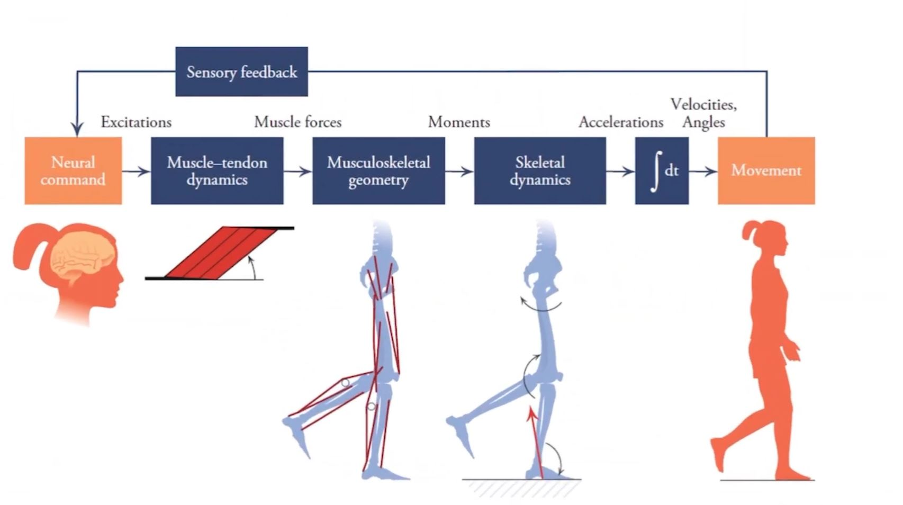
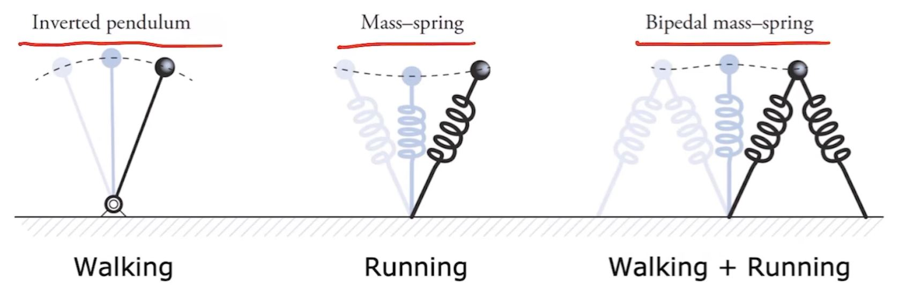
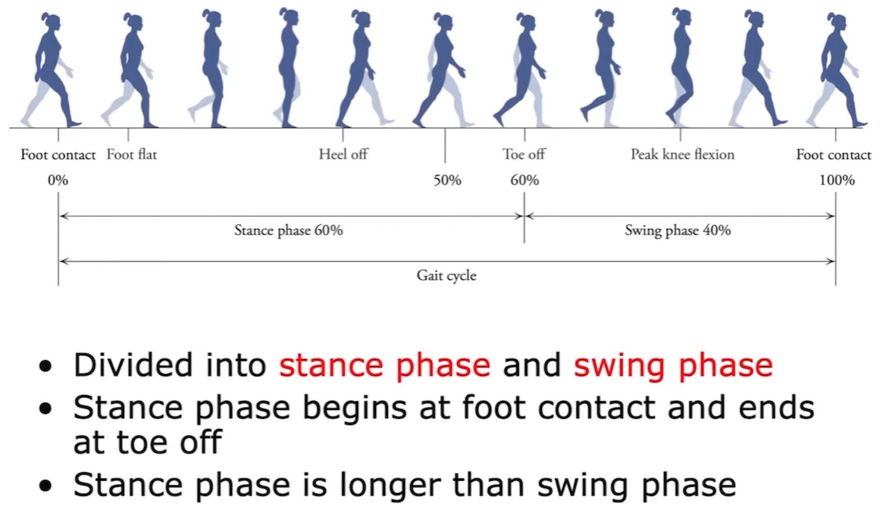
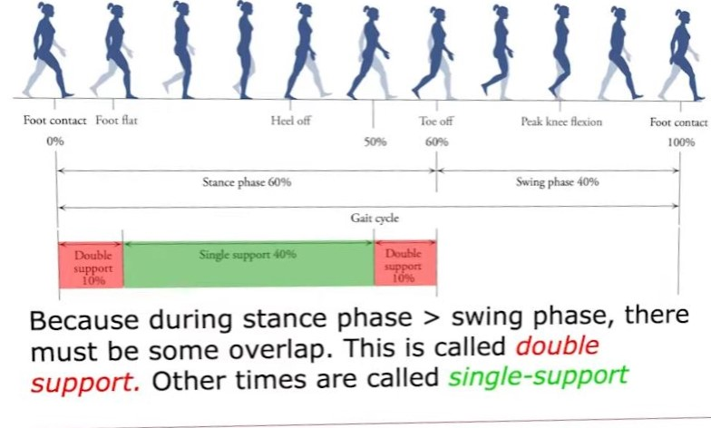

This content is based on vidoes from [Biomechanics of Movement](https://youtube.com/playlist?list=PL_uk_kfAmFLrtzEfv6njXooOPae3jI1q6&si=Szmihd6yMOVyLQfk)

Content:
1. Locomotion
2. Production of Movement
3. Analysis of Movement
4. Muscle-Driven Locomotion

Production of movement

# 1. Locomotion
## Walking and Running 

### Walking Gait Cycle

### Interaction between legs

